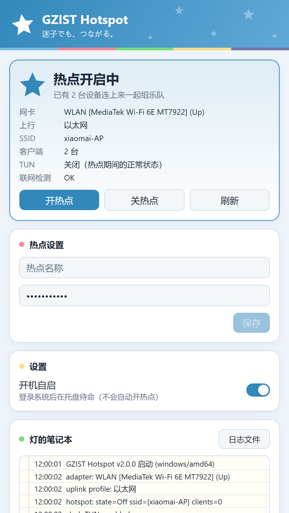

<div align="center">


# GZIST Hotspot

**广州理工学院校园网 · 有线网一键转 WiFi 热点客户端**

[](https://github.com/xiaomai1011/GZIST-Hotspot/releases/latest)
[](https://github.com/xiaomai1011/GZIST-Hotspot/releases)
[](LICENSE)
<br>


[](https://github.com/egoist/mygo)

**[⬇️ 下载](https://github.com/xiaomai1011/GZIST-Hotspot/releases/latest)** · [安装](#-安装) · [快速上手](#-快速上手) · [日常使用](#-日常使用) · [常见问题](#-常见问题)

</div>

---

填一次热点名称和密码，之后它就待在托盘里，**点一下「开热点」，1~2 分钟内把电脑的有线网变成 WiFi**，手机 / 平板 / 笔记本连上就能上网——校园网自始至终只看到这一台电脑，完美绕开「一账号一设备」的互踢。

<p align="center">
  
  &nbsp;&nbsp;
  
</p>
<p align="center"><sub>左：主窗口　右：托盘图标随状态变化（绿色星星是本程序的标识，和校园网保活 GZIST-NetKeeper 的蓝色星区分开）</sub></p>

## ✅ 适合谁用

**适合你，如果：**

- 校园网（或公司/宿舍网）是**「一账号一设备」**——新设备登录会把已在线的设备踢下线，两台设备互相踢
- 你有一台**带有线网口且能上网**的电脑（台式机插网线最典型；笔记本插网线同样行，轻薄本没网口加个转接头即可）
- 你想给手机 / 平板 / 其他笔记本共享网络，但**不想买第二个路由器、不想一直开手机热点、不想碰命令行**
- 你用的是 Windows 10（1809+）或 Windows 11

**帮不了你，如果：**

- 电脑的无线网卡**不支持 Wi-Fi Direct** 且你不想换卡（下面常见问题里有 10 秒自查命令和选购指南，先查再下结论——很多近几年的内置网卡其实支持）
- 电脑**没有可用的有线网络**（本工具的唯一上行就是网线；纯 WiFi 环境请直接用系统自带「移动热点」连 WiFi 源）
- 你在用 macOS / Linux（本工具是 Windows 专属）
- 你的学校明令禁止网络共享且你不想承担风险（技术上一台主机共享完全可行，但请先了解并遵守学校规定）

## 📦 安装

到 **[Releases 页面](https://github.com/xiaomai1011/GZIST-Hotspot/releases/latest)** 下载文件：

| 文件 | 怎么用 |
|---|---|
| `GZIST-Hotspot-x.y.z.exe` | 绿色单文件，放到任意文件夹**双击即用**，删除即卸载 |
| `GZIST-Hotspot-x.y.z-Setup.exe` | 安装器，双击安装并创建开始菜单快捷方式 |

两种方式**都不需要管理员权限**，也不会写注册表（绿色版零残留；安装版卸载走「设置 → 应用」）。

### 第一次打开被系统拦住？

安装包没有购买商业代码签名证书，第一次打开时 Windows 会弹「Windows 已保护你的电脑」——点 **更多信息 → 仍要运行**，只需要做一次。

## 🚀 快速上手

1. **打开 GZIST Hotspot**，第一次运行会自动弹出主窗口。
2. 在 **热点设置** 卡片里填写 **热点名称** 和 **密码**（至少 8 位），点 **保存**。密码会存进 Windows 凭据管理器，之后一直显示在框里；**清空再保存 = 删除密码**。
3. 确认主机有线网能上网，点 **开热点**，等 1~2 分钟。状态卡变成「热点开启中」就说明成功了，手机搜到热点名连上即可。

完成后就可以把窗口关掉了。**关闭窗口不会退出程序**，它会继续在托盘里待命；托盘图标左键单击直接打开主窗口，右键有菜单。

> 💡 主机在用 Clash 的注意：**TUN 模式和热点互斥**（开着 TUN 开热点会整机断网）。程序会自动经 mihomo 管道关闭 TUN 并验证直连，热点期间 TUN 保持关闭是正常现象——需要代理的设备请各自配置，主机用 Clash「系统代理」模式，关热点后再手动开回 TUN。

## 🌟 日常使用

### 看托盘图标就够了

| 图标 | 含义 |
|---|---|
| ★ 实心绿星 | 热点已开启 |
| ☆ 空心绿星 | 热点关闭 |
| 星里有圆点 | 正在开启 / 关闭 |
| 星里有「!」 | 操作失败，打开主窗口看日志找原因 |

### 托盘菜单

右键托盘图标：

- **状态**：当前热点状态（开启中还会显示已连接设备数）
- **开热点 / 关热点**
- **打开主窗口**
- **开机自启**：打勾表示开启（登录系统后自动在托盘待命，**不会自动开热点**）
- **退出**：彻底退出程序（已开启的热点不受影响，可用系统设置关闭）

### 主窗口

| 区域 | 作用 |
|---|---|
| **状态卡** | 热点状态大字 + 网卡 / 上行 / SSID / 客户端数 / Clash TUN / 联网检测六项明细，以及 **开热点 / 关热点 / 刷新** 三个按钮 |
| **热点设置** | 修改热点名称和密码，保存后即时生效（下次开热点用新配置） |
| **设置** | 开机自启开关 |
| **日志（灯的笔记本）** | 最近 200 条记录，每一步（STEP1~STEP5）的进度和结果都在这里；点 **日志文件** 打开完整日志文件 |

### 开热点时程序做了什么

1. **STEP1** 经 mihomo/Clash 的命名管道 API 关闭 TUN，等 6 秒验证直连还活着（失败会自动恢复 TUN 并中止，绝不让你断网）
2. **STEP2** 把热点名称和密码写入系统热点配置
3. **STEP3** 启动移动热点，最长等 45 秒，用**三重信号**交叉验证（tethering 状态 / WFD 虚拟适配器 / SSID 实际广播），防止状态滞后误报；失败自动回滚清理
4. **STEP4** 验证 SSID 已广播、直连可用
5. **STEP5** TUN 保持关闭（TUN 与热点互斥，绝不自动恢复），完成

任何一步失败都会自动清理半开状态、恢复现场，网络始终活着。

## ❓ 常见问题

<details>
<summary><b>热点怎么都开不起来 / 点了没反应</b></summary>

九成是网卡不支持 **Wi-Fi Direct（WFD）**——Windows 移动热点走 WFD，不是老式软AP，对网卡有硬性要求。

**10 秒自查**（下单买卡前先跑这条）：

```powershell
netsh wlan show wirelesscapabilities
```

在你的无线网卡段落里，这三行**必须全是「支持」**：

```
Wi-Fi Direct 设备   : 支持
Wi-Fi Direct GO     : 支持
Wi-Fi Direct 客户端 : 支持
```

**实测对照**：

| 网卡 | 结果 | 说明 |
|---|---|---|
| MediaTek MT7922（Wi-Fi 6E，内置） | ✅ 完美 | 本项目主力实测卡：热点吞吐 257 Mbps+，可带 8 客户端 |
| Realtek RTL8811CU（USB，WiFi 5，绿联 CM496 等） | ❌ 不可用 | 只支持老式软AP，WFD 三项全「不支持」——**我们真实买错的卡** |
| Intel AX200 / AX210 等（Wi-Fi 6/6E，内置） | ✅ 通常支持 | 理论兼容，仍以自查命令的实际输出为准 |

**经验规律**：2019 年之后的**内置**网卡（Intel AX 系列、MT7922/MT7925 等）基本都支持 WFD——先查机器自带的网卡，大概率不用花钱。廉价 **USB 迷你网卡是重灾区**：商家说「支持开热点」往往指软AP。网卡不支持 WFD = 热点永远开不起来且往往是静默失败，任何工具都绕不过去。

**要买的话，按这个优先级买**：

| 方案 | 推荐型号 | 参考价 | 说明 |
|---|---|---|---|
| **台式机首选** | **Intel AX210 PCIe 套装**（自带 2 根外置天线） | ¥60~90 | Intel 卡对 WFD 的支持没有悬念；Wi-Fi 6E；天线伸出金属机箱，信号好 |
| 台式机预算款 | Intel AX200 PCIe 套装（带天线） | ¥40~60 | Wi-Fi 6，同样稳，够用 |
| 笔记本换内置卡 | Intel AX210 M.2 版（2230 规格） | ¥50~70 | 仅适合愿意拆机、且机器无网卡 BIOS 白名单的情况 |
| USB 网卡 | **没有可靠型号可推荐** | — | Realtek 系大概率不支持 WFD；真要买，选支持 7 天无理由退货的店，收货第一件事跑自查命令 |

**避雷清单**：Realtek 系 USB 迷你棒——**RTL8811CU / RTL8821CU / RTL8822BU** 等（常见于绿联、COMFAST 等品牌的入门款），多数只支持老式软AP，对这个用途完全无用（本项目作者就是买了绿联 8811CU 才转向内置卡的真实案例）。

**买前三问**：① 芯片是不是 Intel（AX200/AX210）？② PCIe 套装**是否带外置天线**（藏进金属机箱信号很差）？③ 不支持能否 7 天无理由退货？
</details>

<details>
<summary><b>网卡支持 WFD，热点还是开不起来</b></summary>

十有八九是 Windows 的「Microsoft Wi-Fi Direct Virtual Adapter」设备节点**幻影化**（重启 / 网络重置 / DISM+SFC 都修不好），症状是热点怎么开都失败、事件日志零记录。

完整修复配方（管理员 `pnputil` 删幻影节点 + 重初始化物理网卡，实战验证 5 分钟可修好）见 [`powershell-legacy` 分支的排障手册](https://github.com/xiaomai1011/GZIST-Hotspot/blob/powershell-legacy/重启后操作清单.md)。
</details>

<details>
<summary><b>开着 Clash / VPN 时开热点，网断了</b></summary>

**TUN 模式（虚拟网卡）和热点互斥**，双向实测都会整机断网。程序已经自动处理：开热点前经 mihomo 管道关闭 TUN、验证直连、热点期间保持 TUN 关闭、失败自动恢复。你要做的只有一件事：热点期间用 Clash 的「**系统代理**」模式，关热点之后再手动开回 TUN。建议开热点前先在 Clash 界面把 TUN 开关关一下（让界面记住「关」，避免 Clash 重载时把 TUN 写回来引发冲突）。
</details>

<details>
<summary><b>手机连上热点了但上不了网</b></summary>

按顺序检查：① 主机自己的有线网还通吗（主窗口「联网检测」一项是 OK 还是 FAIL）；② 状态卡里「上行」一项显示的是不是你的有线网络；③ 如果校园网刚认证完不久，等 30 秒再刷新试试；④ 客户端需要访问国际网络时，请在客户端自己配代理——热点出口是直连，不会自动带代理。
</details>

<details>
<summary><b>密码存在哪里，安全吗？</b></summary>

密码存在 **Windows 凭据管理器** 里；如果系统凭据服务不可用，会退回到数据目录下一个仅本人可读（0600）的文件，界面上会提示。密码不进命令行、不明文落盘、不上传任何数据。程序只与 Windows 系统热点 API 和 Clash 的本机管道通信。
</details>

<details>
<summary><b>想改热点名称或密码</b></summary>

在 **热点设置** 卡片里改，点 **保存**。密码框一直显示当前密码；**清空密码再保存 = 删除密码**。改完重新点「开热点」生效。
</details>

<details>
<summary><b>从 PowerShell 脚本版（v1.x）升级</b></summary>

把旧文件夹里的 `hotspot_config.json` 放到新 exe 旁边，首次启动**自动导入**热点名和密码，之后可删除该文件。旧版的 bat 脚本和文档完整保留在 [`powershell-legacy` 分支](https://github.com/xiaomai1011/GZIST-Hotspot/tree/powershell-legacy)，两版可共存。
</details>

## 🗑️ 卸载

- **绿色版**：托盘右键 **退出**，然后删掉 exe 就行（数据在 `C:\Users\<你>\AppData\Roaming\GZIST Hotspot\`，一并删掉即彻底清除；凭据在 Windows 凭据管理器里，想清理就搜「GZIST」删除）
- **安装版**：托盘退出后，设置 → 应用 → 找到 GZIST Hotspot → 卸载

## 🛠️ 开发者

<details>
<summary>展开</summary>

使用 Go 1.27 以上和 [MyGo](https://github.com/egoist/mygo) 原生 UI（GPU 自绘，无 webview / Node）编写。WinRT 热点 API 没有纯 Go 绑定，程序以 `go:embed` 内嵌 PowerShell 5.1 引擎（请求经环境变量传 JSON，凭据不进命令行），保持单文件发布。

```sh
go tool mygo dev                     # 开发模式：改代码后自动重启
go vet ./... && go test ./...        # 静态检查 + 单元测试（含假引擎注入与界面测试）
go tool mygo build                   # 打包当前平台（输出到 build/）
go run ./tools/genicon               # 重新生成 resources/icon.png
GZIST Hotspot.exe -selftest          # 只读自检：打印配置 / TUN / 热点发现结果，绝不动热点
```

| 路径 | 内容 |
|---|---|
| `main.go` | 应用装配：托盘、窗口、开机自启、休眠唤醒、旧配置导入、`-selftest` |
| `view.go` | 主窗口界面（MyGO!!!!! 主题、明暗双主题） |
| `internal/hotspot` | 热点状态机：STEP1~STEP5 流程、回滚、TUN 互斥 |
| `internal/engine` | 内嵌 PowerShell 引擎桥：discover / configure / start-try / stop-wait |
| `internal/clash` | mihomo 命名管道发现与 TUN 读写 |
| `internal/netcheck` | 直连联网检测（HTTPS 证书校验，防认证页劫持误判） |
| `internal/settings` | 设置与 Windows 凭据管理器（回退 0600 文件），旧版配置解析 |
| `internal/art` | 程序绘制的图标（托盘四态、应用图标） |

**发布**：修改 `mygo.json` 的 `version` → `go tool mygo build` → `git tag v2.0.0 && git push origin main v2.0.0` → `gh release create` 上传 exe 与 SHA-256。
</details>

## 声明与致谢

- 本工具只适配广州理工学院校园网环境，仅供学习交流和个人使用，请遵守学校的网络使用规定，自行评估共享政策风险。
- UI 与架构参照 [xiaomai1011/GZIST-NetKeeper](https://github.com/xiaomai1011/GZIST-NetKeeper)（校园网自动登录保活，同为 MyGo 框架客户端）设计；框架来自 [egoist/mygo](https://github.com/egoist/mygo)。
- 托盘图标用**绿色星星**与 NetKeeper 的蓝色星星区分，主题同属 MyGO!!!!! 配色。

## License

[MIT](LICENSE)
